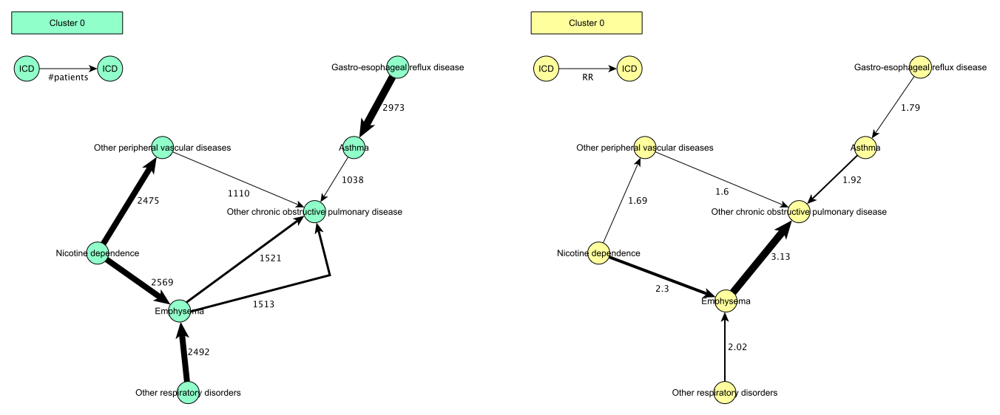

# Patient Trajectory Analysis Library (ptra)

# Index
1. Description
2. Licensing
3. Availability
4. Citing ptra
5. Dependencies
6. Building
7. Command Reference (CLI)
8. Docker
9. Implementation Manual (APIs)

# 1. Description

The Patient Trajectory Analysis Library (ptra) is a software package for analyzing medical event histories. 
It implements an algorithm that can extract statistically relevant trajectories from the event histories of a patient 
population.

For example, consider we have the diagnosis histories of a patient population:
* `History 1: Cough,Broken leg,Dyspnea,Depression,Viral infection,Cough,COPD,...`
* `History 2: Cough,BMI>30,Viral infection,Cough,High blood pressure,Dyspnea,Diabetes,COPD,...`
* `History 3: BMI>30,Tooth ache,Viral infection,Cough,High blood pressure,Broken leg, Diabetes,...`
* `...`
* `History N: ...`

We can see there exists overlap between histories in the population and imagine that we can extract statistically 
relevant trajectories:
* `Cough ---> Dyspnea ---> COPD`
* `BMI>30 ---> High blood pressure ---> Diabetes`

Such trajectories are useful information for predicting patient progression.

The algorithm for extracting trajectories in `ptra` is an adaptation of the method for analyzing trajectories proposed by 
Jensen et al (Temporal disease trajectories condensed from population-wide registry data covering 6.2 million patients, 
Nature Communications, 2014) and consists of three steps:
1. Select medical event pairs `A ---> B` based on relative risk scores for diagnosis pairs `A ---> B` (A followed by B)
2. Build trajectories `A ---> B ---> ... ---> Z` by chaining pairs
3. Cluster trajectories for visual inspection

There are substantial differences between the original Jensen method and the `ptra` implementation. For example, `ptra` has 
a different approach to clustering trajectories which is able to cluster all trajectories found for a population rather
than only a subset in the Jensen method. `Ptra` also proposes a new parallel algorithm that allows for efficient execution 
on a single server-class computer rather than an HPC cluster. This allows `ptra` to be used more interactively. `Ptra` also 
allows adding (user-defined) filters to restrict the analysis to specific patient cohorts or to filter the trajectory 
output. Finally, `ptra` is managed as an open-source project and designed as an extensible framework. For more details on 
each of these topics, please consult the manual.

### TriNetX use case

`Ptra` is designed as a library for implementing analyses of medical event histories, but also implements a concrete use
case. The use case `ptra` implements is based on the TriNetX database that stores patient histories under the form of ICD9
and ICD10 codes. A command-line interface (CLI) is implemented to use `ptra` as a tool for analysis of TriNetX data. For a 
complete list of commandline options, we refer to the Manual Reference Pages of this README.

The implementation of the TriNetx use case is also a good source for examples on how to use `ptra` to implement new use 
cases.

### Using ptra as a library

The `ptra` package is organised as a framework and defines APIs to implement trajectory analyses for any type of medical 
event histories. In principle, any type of medical event that is time stamped could be used for building trajectories: 
e.g. diagnoses (ICD9, ICD10, MedDRA, ...), treatments, drug prescriptions, procedures, etc.

For details on how to implement new use cases, we refer to the Implementation Manual of this README. 


# 2. Licensing

See LICENSE.txt

# 3. Availability

The `ptra` source code is freely available on GitHub. `ptra` is implemented in Go and tested for Linux:

* https://github.com/exascience/ptra

# 4. Citing ptra

Please cite the following article:

Herzeel C, D'Hondt E, Vandeweerd V, Botermans W, Akand M, Van der Aa F, Wuyts R, Verachtert W. A software package for efficient patient trajectory analysis applied to analyzing bladder cancer development. PLOS Digit Health. 2023 Nov 22;2(11):e0000384. doi: 10.1371/journal.pdig.0000384.

# 5. Dependencies

`ptra` uses the `fastrand` library.

The clustering is by default done via the [MCL](https://micans.org/mcl/) tool.

# 6. Building

The following information is relevant if you want to build `ptra` to obtain an executable. `ptra` out of the box implements 
one use case (TriNetX), and building an executable hence by default generates a binary for this use case. For 
instructions how to organise the code to build a binary for a new use case, please see the Implementation Manual.

`ptra` is implemented in Go. Please make sure you have a working installation of Go. You can install Go from the [Go
website](https://golang.org/). Alternatively, most package managers provide options to install Go as a development tool. 
Check the documentation of the package manager of your Linux distribution for details.

First checkout the `ptra` sources using the following command:

    go get -u github.com/exascience/ptra

This downloads the `ptra` Go source code, and creates the `ptra` binary in your configured Go home folder, for example 
`~/go/bin/ptra`. See the [GOPATH](https://golang.org/cmd/go/#hdr-GOPATH_environment_variable) variable for your Go home 
folder.

Add the binary to your path, for example:

    export PATH=$PATH:~/go/bin

# 7. Command Line Interface Reference (CLI)
## TriNetX Use Case
### Name
`ptra` - a commandline tool for extracting statistically relevant trajectories from ICD9/ICD10 diagnosis histories in 
TriNetX format

### Synopsis

```
    ptra patientInfoFile diagnosisInfoFile diagnosesFile outputPath 
        --nofAgeGroups nr --lvl nr --minPatients nr --maxYears nr --minYears nr --maxTrajectoryLength nr
        --minTrajectoryLength nr --name string --ICD9ToICD10File file --cluster --mclPath string
        --iter nr --saveRR file --loadRR file
        --pfilters [age70+ | age70- | male | female | Ta | T0 | Tis | T1 | T2 | T3 | T4 | N0 | N1 | N2 | N3 | M0 | M1 |NMIBC | MIBC | mUC]
        --tumorInfo file
        --tfilters neoplasm | bc
        --treatmentInfo file
```

### Description
The `ptra` command requires four arguments:
1. `patientInfoFile`: this is a csv file containing patient information exported from TriNetX. The expected csv header is:
   `patient_id, sex, race, ethnicity, year_of_birth, age_at_death, patient_regional_location, postal_code, 
   marital_status, reason_yob_missing, month_year_death, source_id`
2. `diagnosisInfoFile`: this is a file mapping diagnosis IDs (ICD10) used in TriNetX onto medical descriptions. This can 
   either be an XML file containing the ICD10 hierarchy with medical descriptors ([icd10cm_tabular_2022.xml](https://www.cms.gov/medicare/icd-10/2022-icd-10-cm))
   or a CCSR with CCSR categorization of the ICD10 hierarchy ([DXCCSR_v2022-1.CSV](https://www.hcup-us.ahrq.gov/toolssoftware/ccsr/dxccsr.jsp))
3. `diagnosesFile`: this is a csv file containing dated diagnoses for patients exported from TriNetX. The expected csv header is: 
   `patient_id,encounter_id,code_system, code, principal_diagnosis_indicator, admiting_diagnosis, reason_for_visit, date,
   derived_by_trinetx, source_id`
4. `outputPath`: a path where the outputs of the `ptra` run can be written.  

`ptra` creates multiple output files: 

1. a tab file with the found trajectories. The tab file contains two lines per trajectory. The first line lists the diagnoses 
  in the trajectory, separated by tabs. The second line lists the number of patients between each transition in the trajectory.

  Example:

  ```
  Cough \tab Dyspnea \tab COPD
  150 \tab 50
  ```
2. a tab file with the found diagnosis pairs and their relative risk scores. There is a single line that list the diagnoses and the RR.
  
  Example:

  ```Cough \tab Dyspnea \tab 1.95```

3. a folder with clustered trajectory output --if `ptra` was requested to cluster its output (`--cluster` flag). This folder 
  contains per requested cluster granularity (`--cluster-granularities`) up to 4 files:
   1. a csv file with cluster information. The header is: `PID,CID,TID,Age`. These represent the patient identifier, cluster 
       identifier, trajectory identifier, and age of the patient at the time they completed the trajectory.
   2. a csv file with information to link the patient analysis identifier used in `ptra` back to the TriNetX identifier. The
       header of the csv file is: `PID,AgeEOI,Sex,PIDString`. This represents the patient id used in `ptra`, the age of the 
       patient at the event of interest, the sex of the patient, and the TriNetX identifier of the patient.
   3. two graph modeling language (.gml) files with the clustered trajectories organised as a subgraph per cluster. gml files
       can be visualised with other tools such as [yEd](https://www.yworks.com/products/yed). There is one .gml file where 
       the trajectory transitions are annotated with the number of patients in the trajectory so far, and second .gml file 
       where the trajectory transitions are annotated with the relative risk score (RR) for the diagnosis pairs.
  
       Example:

       

### Optional flags

The `ptra` command accepts the following optional flags:

* `--nofAgeGroups nr`

The number of age groups to consider when dividing the population into cohorts based on age. The tool automatically
detects the oldest and youngest patients from input. The number of age groups is used to divide the minimum birth
year and maximum birth year into age ranges. E.g. min birth year: 1900, max birth year: 2020, and nr of age groups:
10, will create 10 cohorts where age ranges from [0,12],[12,22],...[108,120].

* `--lvl nr`

Sets the ICD10 level for the diagnosis input [0-6]. The tool maps all ICD10 codes to a medical meaningful term based on
this chosen level. ICD10 codes of lower levels may be combined into the same code of a higher level. E.g. A00.0
Cholera due to Vibrio cholerae 01, biovar cholerae and A00.1 Cholera due to Vibrio cholerae 01, biovar eltor are lvl
3 codes and may be collapsed to A00 Cholera in lvl 2, or A00-A09 Intestinal infectious diseases in lvl 1, or A00-B99
Certain infectious and parasitic diseases in lvl 0.

* `--minPatients nr`

Sets the minimum required number of patients in a trajectory.

* `--maxYears nr`

Sets the maximum number of years between subsequent diagnoses to be considered for inclusion in a trajectory. E.g.
0.5 for half a year.

* `--minYears nr`

Sets the minimum number of years between subsequent diagnoses to be considered for inclusion in a trajectory. E.g. 0.5 
for half a year.

* `--maxTrajectoryLength nr`

Sets the maximum length of trajectories to be included in the output. E.g. 5 for trajectories with maximum 5 diagnoses.

* `--minTrajectoryLength nr`

Sets the minimum length of trajectories to be included in the output. E.g. 3 for trajectories with minimum 3 diagnoses.

* `--name string`

Sets the name of the experiment. This name is used to generate names for output files.

* `--ICD9ToICD10File file`

A json file that provides a mapping from ICD9 to ICD10 codes. The input may be mixed ICD9 and ICD10 codes. With this
mapping, the tool can automatically convert all diagnosis codes to ICD10 codes for analysis.

* `--cluster`

If this flag is passed, the computed trajectories are clustered and the clusters are outputted to file.

* `--mclPath`

Sets the path where the mcl binaries can be found.

* `--iter nr`

Sets the number of iterations to be used in the sampling experiments for calculating relative risk ratios. If iter
is 400, the calculated p-values are within 0.05 of the true p-values. For iter = 10000, the true p-values are within
0.01 of the true p-values. The higher the number of iterations, the higher the runtime.

* `--saveRR file`

Save the RR matrix, a matrix that represents the RR calculated from the population for each possible combination of
ICD10 diagnosis pairs. This matrix can be loaded in other `ptra` runs to avoid recalculating the RR scores. This can
be useful if parameters want to be explored that do not impact the RR calculation itself. Only `iter`, `maxYears` and
`minYears`, and `filters` influence RR calculation. Variations of other parameters for constructing trajectories from RR
scores, such as `maxTrajectoryLenght`, `minTrajectoryLength`, `minPatients`, `RR` etc might be explored in other runs.

* `--loadRR file`

Load the RR matrix from file. Such a file must be created by a previous run of `ptra` with the `--saveRR` flag.

* `--pfilters age70+ | age70- | male | female | Ta | T0 | Tis | T1 | T2 | T3 | T4 | N0 | N1 | N2 | N3 | M0 | M1 |NMIBC | MIBC | mUC`

A list of filters for selecting patients from which to derive trajectories.

* `--tumorInfo file`

A file with information about patients and their tumors. This file contains annotations about the stage of the
bladder cancer at a specific time. Cf. TriNetX tumor table. This information is used by filters.

* `--tfilters neoplasm | bc`

A list of filters for reducing the output of trajectories. E.g. neoplasm only outputs trajectories where there is at
least one diagnosis related to cancer. bc only outputs trajectories where one diagnosis is assuming to be related to
bladder cancer.

* `--treatmentInfo file`
 
A file with information about patients and their treatments, e.g. MVAC,radical cystectomy, etc. If this file is
passed, the treatments will be used as diagnostic codes to calculated trajectories.

# 8. Docker

A Dockerfile is available for `ptra`. 
Building the docker image requires a working installation of Docker. Please check the documentation of your OS.

## Building the docker image

The docker image can be built with the following command:

```docker build -t ptra:latest .```

## Running the docker image

The docker image can be run with the following command:

```docker run -v $(pwd)/.input:/input -v $(pwd)/.output:/output ptra:latest```

This command assumes that the input files (see "Command Line Interface Reference" paragraph) are located in the .input folder and are named:
* `patients.csv`
* `diagnosis.csv`
* `physicianInfoFile.xml` or `physicianInfoFile.csv`

WARNING: This command will trigger the CLI and store all generated files in the mounted `.output` folder. Make sure that the `.output` folder is created by a non-root user, preferably a user with UID=1000 AND GUID=100. If you notice that the CLI could not successfully complete because of a "Permission denied" error.

### Environment variables 

By providing environment variables you can change the CLI parameters.
The env variables correspond to the CLI parameters and flags. All env variables are optional.


| ENV                   | cli param/flag       | Description                                                                                                                                                     | Default                             |
|-----------------------|----------------------|-----------------------------------------------------------------------------------------------------------------------------------------------------------------|-------------------------------------|
| OUTPUT_FOLDER         |                      | Location where the output folder and files will be stored. This is most likely the folder where you mounted the volume + an optional folder, eg /output_folder/ | /output/                            | 
| INPUT_FOLDER          |                      | Location where the input files are available. This is most likely the folder where you mounted the input volume + an optional folder, eg /input/                | /input/                             | 
| PATIENT_FILE          | patientInfoFile      | Name of file containing patient data                                                                                                                            | patients.csv                        |
| DIAGNOSIS_INFO_FILE   | diagnosisInfoFile    | Name of the file containing mapping diagnosis IDs (ICD10) used in TriNetX onto medical descriptions                                                             | diagnosisInfo.xml/diagnosisInfo.csv |
| DIAGNOSES_FILE        | diagnosesFile        | Name of the file containing dated diagnoses for patients exported from TriNetX.                                                                                 | diagnoses.csv                       |
| NUMBER_OF_AGE_GROUPS  | nofAgeGroups         |                                                                                                                                                                 |                                     |
| LEVEL                 | lvl                  |                                                                                                                                                                 |                                     |
| MIN_PATIENTS          | minPatients          |                                                                                                                                                                 |                                     |
| MAX_YEARS             | maxYears             |                                                                                                                                                                 |                                     |
| MIN_YEARS             | minYears             |                                                                                                                                                                 |                                     |
| MAX_TRAJECTORY_LENGTH | maxTrajectoryLength  |                                                                                                                                                                 |                                     |
| MIN_TRAJECTORY_LENGTH | minTrajectoryLength  |                                                                                                                                                                 |                                     |
| NAME                  | name                 |                                                                                                                                                                 |                                     |
| ICD9_TO_ICD10_FILE    | ICD9ToICD10File      |                                                                                                                                                                 |                                     |
| CLUSTER               | cluster              |                                                                                                                                                                 |                                     |
| MCL_PATH              | mclPath              |                                                                                                                                                                 |                                     |
| ITER                  | iter                 |                                                                                                                                                                 |                                     |
| SAVE_RR               | saveRR               |                                                                                                                                                                 |                                     |
| LOAD_RR               | loadRR               |                                                                                                                                                                 |                                     |
| PFILTERS              | pfilters             |                                                                                                                                                                 |                                     |
| TUMOR_INFO            | tumorInfo            |                                                                                                                                                                 |                                     |
| TFILTERS              | tfilters             |                                                                                                                                                                 |                                     |
| TREATMENT_INFO        | treatmentInfo        |                                                                                                                                                                 |                                     |
| CLUSTER_GRANULARITIES | clusterGranularities |                                                                                                                                                                 |                                     |
| NUMBER_OF_THREADS     | nrOfThreads          |                                                                                                                                                                 |                                     |
| RR                    | RR                   |                                                                                                                                                                 |                                     |

**NOTE: `--cluster` is a flag without parameter: to enable it, set its related environment variable `CLUSTER` to `1`**.

An example:

```bash
docker run -v $(pwd)/.input:/input -v $(pwd)/.output:/output -e DIAGNOSIS_INFO_FILE=di.xml -e NUMBER_OF_AGE_GROUPS=20 PATIENT_FILE=p.csv -e ptra:latest
```
indicates that the diagnosis file is named di.xml and the patient file is named p.csv.  The number of age groups will be 20.

TIP: use the --env-file docker cli flag instead of specifying all the env variables in the command.  

# 9. Implementation Manual (APIs)

The Patient Trajectory Analysis library is organised as a framework to allow easy reuse of its code, for example to 
implement trajectory analysis of new medical event data sets.

The source code has been extensively documented and this documentation can be viewed with [godoc](https://pkg.go.dev/golang.org/x/tools/cmd/godoc).

## Code organisation

The `ptra` package is organised as follows:

* `ptra`: top-level package which contains the main, README, and license
  * `trajectory`: this package contains the core of `ptra`. It implements the key data structures and algorithms for 
  calculating relative risk ratios of diagnosis pairs and for deriving trajectories from those pairs.
  * `cluster`: this package contains the code for clustering trajectories.
  * `plot`: this package contains all code for writing `ptra` output to disk.
  * `app`: this package contains all code specific to a use case. This is where parsing of input files into core data
  structures is located. It also contains definitions of use case-specific data filters. It is also where to put a use-case 
  specific commandline interface.
  * `utils`: this package contains some utility functions and data structures.

## Adding filters

The `ptra` package defines _filters_ as a mechanism to reduce data input and data output. Concretely, two types of filters 
are possible: patient filters and trajectory filters.

### Patient filters

The trajectory package defines a standard set of patient filters (`ptra/trajectory/filters.go`). The standard API to 
implement a patient filter is given by the interface:

```
type PatientFilter func(patient *Patient, info interface{}) bool
```

A patient filter is a function that takes as input a patient object and returns a boolean as output. When 
a filter returns `false`, the patient is removed from the input for calculating trajectories. Otherwise, when the filter 
returns `true`, the patient is kept for trajectory calculation.

A simple filter implementation is the following:

```
func MaleFilter(p *Patient) bool {
     return p.Sex != Male
}
```

It is a filter to remove males from the input data for computing trajectories. 

Patient filters are called by the function `ApplyPatientFilters`, which is called during input parsing 
(e.g. `ParseTriNetXData` in `app/parseData.go`). 

In order to implement a new patient filter, one has to implement the above interface. The CLI also has to be extended to 
be able to pass the new filter: extend `getPatientFilter` in `ptra/main.go`.

In order to implement patient filters, one has to have an understanding of the structure used to implement patients, cf.
`trajectory.Patient` and the functions that operate on this type. Please consult the godoc generated documentation for 
details:

```
type Patient struct {
	PID       int            //Unique patient ID
	PIDString string         //Patient ID from input (e.g. TriNetX string)
	YOB       int            //Year of birth
	CohortAge int            //Age range a patient belongs to
	Sex       int            //0 = male, 1 = female
	Diagnoses []*Diagnosis   //List of patient's diagnoses, sorted by date <, unique diagnosis per date
	EOIDate   *DiagnosisDate //Date of the event of interest, e.g. day of cancer diagnosis
	DeathDate *DiagnosisDate //Date of death
	Region    int            //Region where the patient lives
}
```

### Trajectory filters

The trajectory package defines a standard set of trajectory filters (`ptra/trajectory/filters.go`). The standard API to 
implement a trajectory filter is given by the interface:

```
type TrajectoryFilter func(t *Trajectory) bool
```

A trajectory filter is a function that takes as input a trajectory object and returns a boolean as output. When it 
returns `false`, the trajectory is removed from output, but when it returns `true`, the trajectory is just kept for 
output.

An example filter implementation is listed below:

```
func BladderCancerTrajectoryFilter(exp *trajectory.Experiment) trajectory.TrajectoryFilter {
	return func(t *trajectory.Trajectory) bool {
		for _, did := range t.Diagnoses {
		    icdCode := exp.IdMap[did]
		    if len(icdCode) >= 3{
		        subCode := icdCode[0:3]
		        if subCode == "C67"{
		            return true
		        }
		    }
		}
		return false
	}
}
```

This implements a filter that ensures only trajectories containing a bladder cancer diagnosis are kept in the output.

Trajectory filters are called by the function `BuildTrajectories` in `ptra/trajectory/trajectory.go`. 

In order to implement a new trajectory filter, one has to implement the above trajectory filter interface. The CLI also 
needs to be extended to be able to pass the new filter: extend `getTrajectoryFilter` in `ptra/main.go`.

One also needs to have a good understanding of the structure that is used to implement trajectories, cf. 
`trajectory.Trajectory` and the functions that operate on this type. Please check out the godoc generated 
documentation for details:

```
type Trajectory struct {
	Diagnoses      []int        // A list of diagnosis code IDs that represents the trajectory
	PatientNumbers []int        // A list with nr of patients for each transition in the trajectory
	Patients       [][]*Patient // A list of patients with the given trajectory
	ID             int          // An analysis id
	Cluster        int          //A cluster ID to which this trajectory is assigned to
}
```

## Implementing a new use case

For implementing trajectory analysis on a new data set, a protocol consisting of five steps can be followed:
1. Parse the input data into a `trajectory.Experiment` structure. 
2. Initialize the experiment's relative risk ratios.
3. Build the experiment's trajectories.
4. Output the found trajectories to disk.
5. Cluster the found trajectories and write the outputs to disk.

These steps are explained in detail in the next sections.

### 1. Parse the data inputs into a `trajectory.Experiment` structure.

The core data structure for implementing trajectory analysis is the `trajectory.Experiment` structure:

```
type Experiment struct {
    Name                                               string         //Name of the experiment, for printing
	NofAgeGroups, Level, NofDiagnosisCodes             int
	DxDRR                                              [][]float64    //Relative risk score (RR) for each disease pair
	DxDPatients                                        [][][]*Patient //Patients diagnosed for each diesease pair
	NameMap                                            map[int]string //Maps diagnosis ID to medical name
	IdMap                                              map[int]string //Maps the analysis DID to the original diagnostic ID used in the input data
	Cohorts                                            []*Cohort      //Cohorts in the experiment
	DPatients                                          [][]*Patient   //Patients diagnosed for each disease
	Pairs                                              []*Pair        //Alist of all selected pairs that are used to compute trajectories
	Trajectories                                       []*Trajectory  //A list of computed trajectories
}
```

Some of these slots are initialised by ptra functions in subsequent steps of the protocol, but the following need to be 
initialised explicitly:

* `Name`: a name for the experiment. This name is used for creating file names when writing output to disk.
* `NofAgeGroups`: the number of age groups for the experiment. This can be a parameter passed via the CLI as in the 
TriNetX case cf. `ptra/main.go`.
* `Level`: this is an optional integer slot to hold a 'level'. It is only used for logging. For the TriNetX case, this 
refers to the level in the ICD10 hierarchy the analysis operates on.
* `NofDiagnosisCodes`: this is the number of diagnosis codes used in the input data. This number is used to size different
data structures that are initialised for calculating RR scores. For example, the idea is that diagnosis codes/medical 
events are mapped on a unique analysis ID, counting from `0` to `NofDiagnosisCodes`. We can then initialise, for example, an 
array of size `NofDiagnosisCodes` and use the analysis ID of a diagnosis as an index into this array.

    For example, assume the following medical events occur in the diagnosis histories: 

    ```
     Cough, Dyspnea, COPD, BMI>30, High Blood Pressure, Diabetes
     0      1        2     3       4                    5
   ```
  There are 6 medical events, so `NofDiagnosisCodes = 6`. We could assign them analysis IDs as shown by using a simple 
  counter. 

* `DxDRR`: this is a matrix that stores for each diagnosis pair the relative risk score for that pair. This matrix must be 
initialized when creating a `trajectory.Experiment` via the function `trajectory.MakeDxDRR`. That function's signature 
is: `func MakeDxDRR(size int) [][]float64 `. It takes one size parameter, cf. the number of diagnosis codes in the input 
(`NofDiagnosisCodes`). The actual RR are calculated and filled in at a later step of the protocol (step 2). 
* `DxDPatients`: this is a matrix that stores for each diagnosis pair the patients diagnoses with that pair. The matrix 
must be initialized when creating a `trajectory.Experiment` via the function `trajectory.MakeDxDPatients`. This function
takes a single size parameter, cf. `NofDiagnosisCodes`.
* `NameMap`: maps analysis IDs for diagnoses onto a medical event name. For example: `0 --> Cough, 
1 --> Dyspnea, 2 --> COPD, 3 --> BMI>30, 4 --> High Blood Pressure, 5 --> Diabetes`. This map should be extracted from 
input data. For example, in the TriNetX case, this map is extracted from the ICD10 hierarchy definition, cf. the function 
`initializeIcd10AnalysisMapsFromXML`.
* `IdMap`: maps analysis IDs for diagnoses onto diagnosis ID that occurs in the input. For example, in the TriNetX case, 
this would be ICD10 code of a diagnosis. See `initializeIcd10AnalysisMapsFromXML` as an example.
* `Cohorts`: this represents an array with all cohorts in the experiment. The statistical model behind the RR calculation 
divides the patients into cohorts according to their sex and age. This is to make sure statistical sampling experiments 
can compare similar patients (to avoid Simpson's paradox). Concretely, patients are split into male and female patients. 
Both sexes are subsequently split up into age groups. 

    For example:
    ```
    Males:      cohort1: age = [0-30[, cohort2: age = [30-60[, cohort3: age = [60-90[, cohort4: age = [90-120]
 
    Females:    cohort5: age = [0-30[, cohort6: age = [30-60[, cohort7: age = [60-90[, cohort8: age = [90-120]
    ```
    Cohorts are initialized by calling the function `trajectory.InitializeCohorts`. The signature of this function is:

    `func InitializeCohorts(ps *PatientMap, nofAgegroups, nofDiagnosisCodes int) []*Cohort`

    * The `ps` argument represents the patient object parsed from the input. The patients should be passed as a 
    `trajectory.PatientMap` object:

    ```
    type PatientMap struct {
        PIDStringMap map[string]int   //maps patient string id onto an int PID
        Ctr          int              //total nr of patients parsed, also used for creating PIDs
        PIDMap       map[int]*Patient //maps PID onto a patient object that contain YOB, sex, age group, etc
        MaleCtr   int                 // optional info for logging
        FemaleCtr int
    } 
    ```
    The slots of this structure are: `PIDStringMap` a map that maps the patient id used in the input files onto a new ID 
    used for analysis. `Ctr`: the total number of patients parsed. This counter can be used to generate analysis IDs for
    patients. `PIDMap`: maps the patient analysis ID onto `Trajectory.Patient` objects. There is also two optional 
    counters for counting the number of males and females.
  * The `nofAgegroups` argument are the number of age groups to use when defining cohorts. Can be a CLI parameter.
  * The `nofDiagnosisCodes`: the number of different diagnosis codes used in the input.
* `DPatients`: has for each diagnosis the list of patients that are diagnosed with that diagnosis. This can be obtained 
from the patient lists of the cohorts collected by `trajectory.InitializeCohorts` (see `Cohort.DPatients`). 
* `Pairs` and `Trajectories` do not need to be initialized, as they are filled in at later steps.

### 2. Initialize the experiment's relative risk ratios (RR). 

The relative risk ratios (RR) are initialized by calling the function 
`trajectory.InitializeExperimentRelativeRiskRatios`. The signature of this function is:
```

func InitializeExperimentRelativeRiskRatios(exp *Experiment, minTime, maxTime float64, iter int)

```
The parameters are:
* the `trajectory.Experiment` object `exp` created in step 1
* the `minTime` and `maxTime` parameters respectively for the minimum and maximum allowed time between diagnoses to be 
considered for RR calculation. This is a parameter passed via the CLI.
* the `iter` parameter that determines the number of sampling iterations for calculating the RR. This is a parameter 
passed via CLI.

### 3. Build the experiment's trajectories.

The trajectories are built by calling the function `trajectory.BuildTrajectories`. The signature of this function is:

```

BuildTrajectories(exp *Experiment, minP, maxL, minL int, minT, maxT, minRR float64, filters []TrajectoryFilter) []*Trajectory 

```

The parameters are:
* the `trajectory.Experiment` object `exp` created in step 1
* the `minP` parameter for the minimum number of patients for a trajectory to be considered. This is a parameter passed 
via the CLI.
* the `minL` and `maxL` parameters respectively for the minimum and maximum length for a trajectory to be considered. 
These parameters are passed via the CLI.
* the `minT` and `maxT` parameters respectively stand for the minimum and maximum time between trajectory transitions.
These parameters are passed via the CLI.
* the `minRR` for the minimum relative risk score (RR) of a diagnosis pair to be considered for building trajectories.

### 4. Output the found trajectories to disk.

The trajectories can be outputted to disk by calling the `trajectory.PrintTrajectoriesToFile` function. This function 
takes as input the experiment object created in step 1 and an output path. 

### 5. Cluster the trajectories and output the clusters to disk.

The trajectories can be clustered by calling the function `cluster.ClusterTrajectoriesDirectly`. The signature of this 
function is:

```

func ClusterTrajectoriesDirectly(exp *trajectory.Experiment, granularities []int, path, pathToMcl string) {

```

The parameters of this function are:
* the `trajectory.Experiment` object `exp` created in step 1
* the `granularities` parameter: a list of granularities for the clustering step. This is a parameter passed via the CLI.
* the `pathToMCL` parameter: a path to the clustering tool. This parameter is passed via the CLI.
